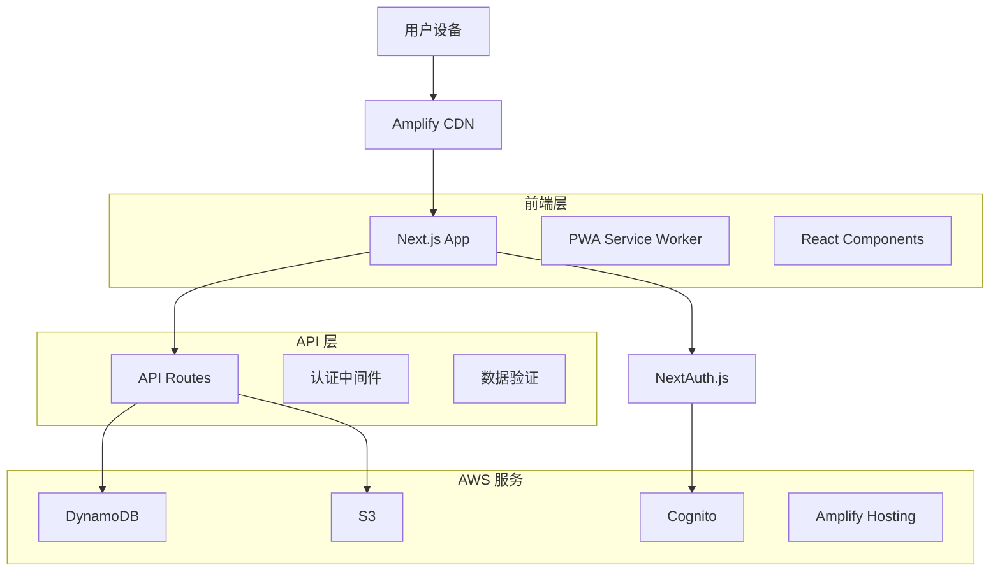
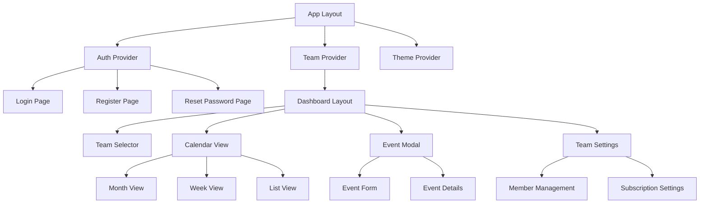

# 设计文档

## 概述

团队日历同步器采用现代化的全栈架构，基于 Next.js 14 App Router 构建，利用 AWS Amplify 生态系统提供可扩展的云服务。应用采用 PWA 架构，支持离线功能和移动端安装，为团队提供高效的日历协作体验。

## 架构

### 整体架构



### 技术栈

**前端技术：**

- Next.js 14 (App Router) - 全栈 React 框架
- TypeScript - 类型安全
- Tailwind CSS - 样式框架
- shadcn/ui - UI 组件库
- FullCalendar - 日历组件
- PWA - 渐进式 Web 应用

**后端技术：**

- Next.js API Routes - REST API
- NextAuth.js - 认证管理
- AWS Cognito - 用户身份服务
- DynamoDB - NoSQL 数据库
- S3 - 文件存储

**部署平台：**

- AWS Amplify Hosting - 静态网站托管
- Amplify CI/CD - 自动部署

## 组件和接口

### 前端组件架构



### 核心组件设计

**1. 认证组件**

```typescript
// AuthProvider - 全局认证状态管理
interface AuthContextType {
  user: User | null;
  login: (email: string, password: string) => Promise<void>;
  logout: () => Promise<void>;
  register: (email: string, password: string) => Promise<void>;
  resetPassword: (email: string) => Promise<void>;
}

// ProtectedRoute - 路由保护
interface ProtectedRouteProps {
  children: React.ReactNode;
  requiredRole?: UserRole;
}
```

**2. 团队管理组件**

```typescript
// TeamProvider - 团队状态管理
interface TeamContextType {
  currentTeam: Team | null;
  teams: Team[];
  switchTeam: (teamId: string) => void;
  createTeam: (data: CreateTeamData) => Promise<Team>;
  inviteMember: (email: string, role: UserRole) => Promise<string>;
}

// TeamSelector - 团队切换器
interface TeamSelectorProps {
  teams: Team[];
  currentTeam: Team | null;
  onTeamChange: (teamId: string) => void;
}
```

**3. 日历组件**

```typescript
// CalendarView - 主日历视图
interface CalendarViewProps {
  events: CalendarEvent[];
  view: 'month' | 'week' | 'list';
  onViewChange: (view: CalendarView) => void;
  onEventClick: (event: CalendarEvent) => void;
  onDateClick: (date: Date) => void;
}

// EventModal - 事件创建/编辑模态框
interface EventModalProps {
  event?: CalendarEvent;
  isOpen: boolean;
  onClose: () => void;
  onSave: (event: CalendarEventData) => Promise<void>;
}
```

### API 接口设计

**认证 API**

```typescript
// POST /api/auth/register
interface RegisterRequest {
  email: string;
  password: string;
  name: string;
}

// POST /api/auth/login
interface LoginRequest {
  email: string;
  password: string;
}
```

**团队管理 API**

```typescript
// GET /api/teams
interface TeamsResponse {
  teams: Team[];
}

// POST /api/teams
interface CreateTeamRequest {
  name: string;
  description?: string;
}

// POST /api/teams/[id]/invite
interface InviteRequest {
  email: string;
  role: UserRole;
}

// GET /api/teams/[id]/members
interface MembersResponse {
  members: TeamMember[];
}
```

**事件管理 API**

```typescript
// GET /api/teams/[teamId]/events
interface EventsResponse {
  events: CalendarEvent[];
}

// POST /api/teams/[teamId]/events
interface CreateEventRequest {
  title: string;
  startTime: string;
  endTime: string;
  isAllDay: boolean;
  location?: string;
  description?: string;
  category: EventCategory;
  color: string;
}

// PUT /api/teams/[teamId]/events/[eventId]
interface UpdateEventRequest extends CreateEventRequest {
  id: string;
}
```

**订阅 API**

```typescript
// GET /api/teams/[teamId]/subscription
interface SubscriptionResponse {
  subscriptionUrl: string;
  regenerateUrl: () => Promise<string>;
}

// GET /api/teams/[teamId]/export
interface ExportResponse {
  icsContent: string;
}
```

## 数据模型

### DynamoDB 表设计

**用户表 (Users)**

```typescript
interface User {
  PK: string; // USER#${userId}
  SK: string; // USER#${userId}
  userId: string;
  email: string;
  name: string;
  createdAt: string;
  updatedAt: string;
  GSI1PK: string; // EMAIL#${email}
  GSI1SK: string; // USER#${userId}
}
```

**团队表 (Teams)**

```typescript
interface Team {
  PK: string; // TEAM#${teamId}
  SK: string; // TEAM#${teamId}
  teamId: string;
  name: string;
  description?: string;
  ownerId: string;
  subscriptionKey: string;
  createdAt: string;
  updatedAt: string;
}
```

**团队成员表 (TeamMembers)**

```typescript
interface TeamMember {
  PK: string; // TEAM#${teamId}
  SK: string; // MEMBER#${userId}
  teamId: string;
  userId: string;
  role: 'owner' | 'member' | 'viewer';
  joinedAt: string;
  GSI1PK: string; // USER#${userId}
  GSI1SK: string; // TEAM#${teamId}
}
```

**事件表 (Events)**

```typescript
interface CalendarEvent {
  PK: string; // TEAM#${teamId}
  SK: string; // EVENT#${eventId}
  eventId: string;
  teamId: string;
  title: string;
  startTime: string;
  endTime: string;
  isAllDay: boolean;
  location?: string;
  description?: string;
  category: 'meeting' | 'task' | 'reminder';
  color: string;
  createdBy: string;
  createdAt: string;
  updatedAt: string;
  GSI1PK: string; // DATE#${YYYY-MM-DD}
  GSI1SK: string; // TEAM#${teamId}#EVENT#${eventId}
}
```

### 数据访问模式

**主要查询模式：**

1. 获取用户信息：`PK = USER#${userId}`
2. 获取用户的团队：`GSI1PK = USER#${userId}, SK begins_with TEAM#`
3. 获取团队成员：`PK = TEAM#${teamId}, SK begins_with MEMBER#`
4. 获取团队事件：`PK = TEAM#${teamId}, SK begins_with EVENT#`
5. 按日期查询事件：`GSI1PK = DATE#${date}`

## 错误处理

### 前端错误处理

**1. 全局错误边界**

```typescript
interface ErrorBoundaryState {
  hasError: boolean;
  error?: Error;
}

class GlobalErrorBoundary extends Component<Props, ErrorBoundaryState> {
  // 捕获组件错误并显示友好的错误页面
}
```

**2. API 错误处理**

```typescript
interface ApiError {
  code: string;
  message: string;
  details?: any;
}

// 统一的错误处理函数
const handleApiError = (error: ApiError) => {
  switch (error.code) {
    case 'UNAUTHORIZED':
      // 重定向到登录页
      break;
    case 'FORBIDDEN':
      // 显示权限不足提示
      break;
    case 'VALIDATION_ERROR':
      // 显示表单验证错误
      break;
    default:
    // 显示通用错误提示
  }
};
```

### 后端错误处理

**1. API 错误响应格式**

```typescript
interface ApiErrorResponse {
  success: false;
  error: {
    code: string;
    message: string;
    details?: any;
  };
}

// 标准错误代码
enum ErrorCodes {
  UNAUTHORIZED = 'UNAUTHORIZED',
  FORBIDDEN = 'FORBIDDEN',
  VALIDATION_ERROR = 'VALIDATION_ERROR',
  NOT_FOUND = 'NOT_FOUND',
  INTERNAL_ERROR = 'INTERNAL_ERROR',
}
```

**2. 中间件错误处理**

```typescript
const errorHandler = (error: Error, req: NextRequest) => {
  console.error('API Error:', error);

  if (error instanceof ValidationError) {
    return NextResponse.json(
      {
        success: false,
        error: {
          code: 'VALIDATION_ERROR',
          message: error.message,
          details: error.details,
        },
      },
      { status: 400 }
    );
  }

  // 其他错误类型处理...
};
```

## 测试策略

### 前端测试

**1. 单元测试 (Jest + React Testing Library)**

- 组件渲染测试
- 用户交互测试
- 状态管理测试
- 工具函数测试

**2. 集成测试**

- API 集成测试
- 认证流程测试
- 数据流测试

**3. E2E 测试 (Playwright)**

- 用户注册登录流程
- 团队创建和管理
- 事件创建和编辑
- 日历视图切换

### 后端测试

**1. API 测试**

- 端点功能测试
- 认证和授权测试
- 数据验证测试
- 错误处理测试

**2. 数据库测试**

- 数据模型测试
- 查询性能测试
- 数据一致性测试

### 测试覆盖率目标

- 单元测试覆盖率：≥ 80%
- 集成测试覆盖率：≥ 70%
- E2E 测试覆盖关键用户流程

### PWA 和性能优化

**1. Service Worker 策略**

```typescript
// 缓存策略
const cacheStrategy = {
  // 静态资源：缓存优先
  static: 'cache-first',
  // API 数据：网络优先，离线时使用缓存
  api: 'network-first',
  // 图片：缓存优先，后台更新
  images: 'stale-while-revalidate',
};
```

**2. 性能优化**

- 代码分割和懒加载
- 图片优化和 WebP 支持
- 预加载关键资源
- 虚拟滚动处理大量事件
- 防抖和节流优化用户交互

**3. 离线功能**

- 缓存关键页面和数据
- 离线状态检测
- 数据同步队列
- 离线操作提示

### 安全设计

**1. 认证安全**

- JWT 令牌管理
- 刷新令牌机制
- 会话超时处理
- 多设备登录管理

**2. 数据安全**

- 输入验证和清理
- XSS 防护
- CSRF 保护
- SQL 注入防护（虽然使用 NoSQL）

**3. API 安全**

- 请求频率限制
- 权限验证中间件
- 敏感数据加密
- 审计日志记录
